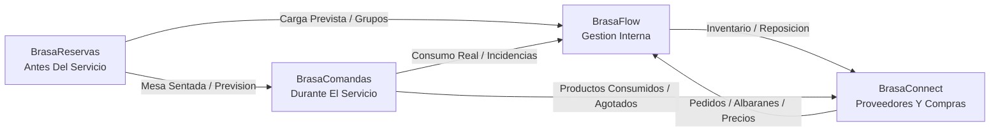

# Conexion Entre Apps Del Ecosistema Brasa

## 1. Idea Central

Las Apps Del Ecosistema Brasa No Son Modulos Amontonados Dentro De Una Sola Pantalla.

Son Productos Hermanos.

Cada Uno Tiene Una Funcion Clara, Pero Pueden Compartir Informacion Cuando Eso Aporta Valor.

## 2. Mapa General

## 3. Que Rol Tiene Cada App

### BrasaReservas

Momento:

`Antes Del Servicio`

Funcion:

- Reservas.
- Clientes.
- Mesas.
- Lista De Espera.
- Prevision De Carga.

### BrasaComandas

Momento:

`Durante El Servicio`

Funcion:

- Mesas Activas.
- Comandas.
- Cocina.
- Barra.
- Estados De Platos.
- Cuenta E Historial De Servicio.

### BrasaFlow

Momento:

`Gestion Diaria Del Negocio`

Funcion:

- Personal.
- Turnos.
- Fichaje.
- Vacaciones.
- Documentos.
- Inventario.
- Temperaturas.
- Recetas.
- Alergenos.
- Configuracion.

### BrasaConnect

Momento:

`Compras Y Relacion Con Proveedores`

Funcion:

- Proveedores.
- Catalogos.
- Pedidos.
- Estados.
- Albaranes.
- Incidencias.
- Historial Compartido.

## 4. Flujos De Informacion

### De BrasaReservas A BrasaComandas

Cuando Un Cliente Llega:

1. La Reserva Esta Confirmada.
2. El Cliente Llega Al Local.
3. La Reserva Se Marca Como Sentada.
4. La Mesa Pasa A Estar Ocupada.
5. BrasaComandas Abre O Recibe Una Comanda.

Datos Que Podrian Viajar:

- Mesa.
- Numero De Personas.
- Nombre Del Cliente.
- Nota De Reserva.
- Preferencias.
- Alergias Declaradas.

### De BrasaReservas A BrasaFlow

Antes Del Servicio, Reservas Puede Ayudar A Planificar.

Datos Que Podrian Viajar:

- Comensales Previstos.
- Horas De Mayor Carga.
- Grupos Grandes.
- Eventos.
- Necesidad De Refuerzo.

Uso En BrasaFlow:

- Revisar Turnos.
- Preparar Personal.
- Anticipar Inventario.
- Ver Carga De Sala Y Cocina.

### De BrasaComandas A BrasaFlow

Durante Y Despues Del Servicio, Comandas Genera Informacion Real.

Datos Que Podrian Viajar:

- Platos Vendidos.
- Bebidas Vendidas.
- Productos Agotados.
- Tiempos De Preparacion.
- Incidencias.
- Mesas Atendidas.
- Carga Por Franja Horaria.

Uso En BrasaFlow:

- Analizar Operativa.
- Ajustar Turnos.
- Revisar Recetas.
- Controlar Inventario.
- Detectar Cuellos De Botella.

### De BrasaFlow A BrasaConnect

BrasaFlow Sabe Que Necesita El Negocio Por Dentro.

Datos Que Podrian Viajar:

- Inventario Bajo.
- Productos Habituales.
- Pedidos Internos.
- Recepciones.
- Incidencias.
- Recetas Que Consumen Producto.

Uso En BrasaConnect:

- Crear Pedido A Proveedor.
- Repetir Pedido Habitual.
- Buscar Proveedor Alternativo.
- Comparar Precios.

### De BrasaConnect A BrasaFlow

BrasaConnect Sabe Que Paso Con Proveedores.

Datos Que Podrian Viajar:

- Pedido Confirmado.
- Pedido Entregado.
- Precio Real.
- Albaran.
- Incidencia.
- Diferencia Entre Pedido Y Recepcion.
- Historial Por Proveedor.

Uso En BrasaFlow:

- Actualizar Compras.
- Revisar Costes.
- Guardar Historial.
- Mejorar Inventario.
- Alimentar Coste De Recetas.

## 5. Ejemplo Completo

Un Restaurante Tiene Una Cena Fuerte Un Viernes.

1. BrasaReservas Muestra 54 Comensales Previstos.
2. BrasaFlow Ayuda A Revisar Turnos Y Refuerzo De Sala.
3. Una Reserva Llega Y Se Marca Como Sentada.
4. BrasaComandas Abre La Mesa Y Envia Platos A Cocina.
5. Durante El Servicio Se Agota La Lubina.
6. BrasaComandas Registra Producto Agotado.
7. BrasaFlow Detecta Consumo Alto.
8. BrasaConnect Permite Pedir Mas Producto Al Proveedor.
9. El Proveedor Confirma El Pedido.
10. El Albaran Queda Guardado Y Vuelve A BrasaFlow.

## 6. Como Explicarlo Sin Tecnica

La Explicacion Simple Es:

`BrasaReservas Prepara La Mesa, BrasaComandas Atiende La Mesa, BrasaFlow Organiza El Negocio Y BrasaConnect Repone Lo Que El Negocio Necesita.`

## 7. Por Que No Hacer Una Sola App Gigante

Porque En Hosteleria Cada Momento Tiene Una Urgencia Distinta.

- Antes Del Servicio Se Necesita Planificacion.
- Durante El Servicio Se Necesita Velocidad.
- En Gestion Interna Se Necesita Control.
- Con Proveedores Se Necesita Historial Y Orden.

Si Todo Vive Mezclado, La App Se Vuelve Pesada.

Separarlo Permite:

- Apps Mas Claras.
- Mejor Venta.
- Mejor Experiencia.
- Crecimiento Por Producto.
- Posibilidad De Vender Por Modulos.

## 8. Como Se Puede Vender

### Como Producto Individual

Cada App Puede Venderse Sola:

- Solo BrasaFlow.
- Solo BrasaReservas.
- Solo BrasaComandas.
- Solo BrasaConnect.

### Como Ecosistema

Tambien Pueden Venderse Juntas:

- BrasaFlow + Reservas.
- BrasaFlow + Comandas.
- BrasaFlow + Connect.
- Ecosistema Completo.

## 9. Mensaje Comercial Del Ecosistema

Brasa Es Un Ecosistema Para Hosteleria Que Ordena El Negocio Por Momentos:

- Antes Del Servicio.
- Durante El Servicio.
- Gestion Interna.
- Compras Y Proveedores.

Cada App Es Independiente, Pero Todas Hablan El Mismo Idioma.
